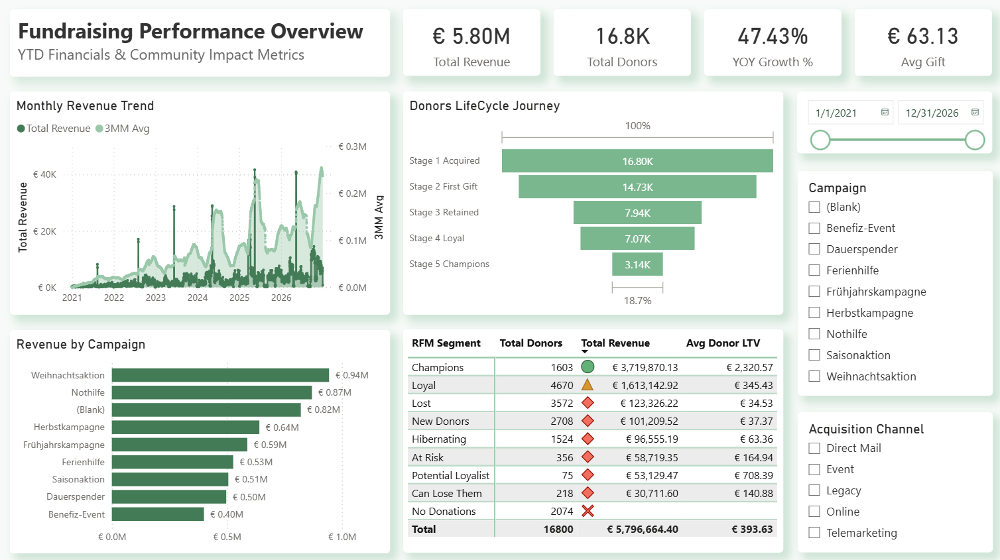
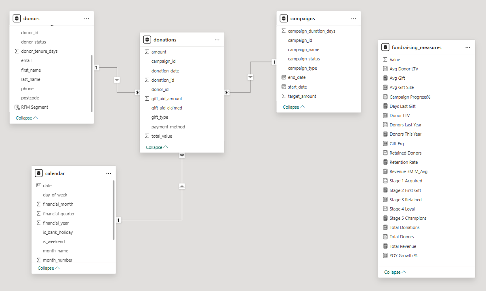

# 🎗️ Fundraising Analytics Dashboard — Power BI + Python

An end-to-end BI portfolio project: a Power BI dashboard analyzing fundraising performance for a fictional German charity, built on a fully synthetic dataset generated with Python.



> **🔗** <a href="https://app.powerbi.com/view?r=eyJrIjoiNjBjNWY3YzQtMjk5OC00ZGVkLWIyNmUtYTkxYjAxOWEwNDVlIiwidCI6ImQ4NTAxOTQ5LWVkYzMtNDk0Mi04ODI3LTY0MDczNjM3NDViMCJ9" target="_blank">View interactive dashboard</a> *(Hosted via Power BI's "Publish to web" — no login required.)*

---

## 📖 About the Project

This project simulates a realistic fundraising analytics scenario for a mid-sized German non-profit ("Community Impact Foundation"). The goal was to go beyond a "connect a dataset, drop in a few visuals" tutorial and design the full BI pipeline from the ground up:

1. **Generate** a believable, five-year synthetic dataset in Python
2. **Model** it as a proper star schema with a dedicated date dimension
3. **Analyze** it in Power BI using DAX for time-intelligence, RFM segmentation, and donor lifecycle metrics
4. **Present** the insights in a clean, executive-ready dashboard

All data is **100% synthetic** — no real donor information is used or referenced.

---

## 📊 Dashboard Highlights

- **YTD KPI cards** — Total Revenue (~€5.8M), Total Donors (~16.8K), YoY Growth (~47%), and Average Gift
- **Monthly Revenue Trend** with a 3-month moving average to smooth out campaign spikes
- **Donor Lifecycle Funnel** — tracks donors from Acquired → First Gift → Retained → Loyal → Champions (18.7% conversion rate)
- **RFM Segmentation Table** — nine behavioral segments (Champions, Loyal, At Risk, Lost, etc.) with total donors, revenue, and Lifetime Value (LTV) per segment
- **Campaign Performance** — revenue breakdown across German-themed campaigns (Weihnachtsaktion, Nothilfe, Herbstkampagne, and more)
- **Interactive filters** — date range slicer, campaign filter, and acquisition channel filter

---

## 🛠️ Tech Stack

| Layer | Tool |
|---|---|
| Data generation | Python 3 (`pandas`, `numpy`, `holidays`) |
| Data storage | CSV (star schema — 1 fact table, 3 dimensions) |
| Analytics & modeling | Power BI Desktop, DAX |
| Visualization | Power BI (built-in visuals) |
| Publishing | Power BI Service — "Publish to web" |

---

## 🧱 Data Model

A classic star schema with one fact table (donations), three dimension tables (donors, campaigns, calendar), and a dedicated table for organizing DAX measures (fundraising_measures).



---

### Table Overview

| Table | Rows | Role |
|---|---|---|
| `donors.csv` | ~16,800 | Dimension — donor profiles |
| `campaigns.csv` | ~8 | Dimension — campaign metadata |
| `calendar.csv` | ~2,190 | Dimension — date table (2021–2026) with German holidays |
| `donations.csv` | ~90,000+ | Fact — individual donation transactions |

---

## 🚀 Getting Started

### Prerequisites

- Python 3.9+
- Power BI Desktop (free download from Microsoft)

### 1. Clone the repository

```bash
git clone https://github.com/tuseeqraza1/fundraising-dashboard.git
cd fundraising-dashboard
```

### 2. Install Python dependencies

```bash
pip install -r requirements.txt
```

### 3. Generate the datasets

```bash
python datasets_generator.py
```

This creates four CSV files: `donors.csv`, `campaigns.csv`, `donations.csv`, and `calendar.csv`.

### 4. Open the Power BI file

Open `FundraisingDashboard.pbix` in Power BI Desktop. If prompted, point the queries to the `data/` folder to refresh from the newly generated CSVs.

---

## ⚠️ Disclaimer

All data in this repository is **synthetic and generated programmatically**. No real donor, organization, or transactional data is included. The fictional charity "Community Impact Foundation" and all named campaigns are for illustrative purposes only. Any resemblance to real organizations is coincidental.

---

## 🙋 About the Author

**Tuseeq Ahmed Raza** — Data Analyst / BI Analyst and Master's student in Computer Science at the University of Bonn.

I built this project to sharpen my end-to-end BI workflow — from data modeling through to dashboard design — and to practice DAX patterns I use in professional work. Feedback and discussion are always welcome.

- 💼 [LinkedIn](https://www.linkedin.com/in/tuseeqraza1/)
- 🐙 [GitHub](https://github.com/tuseeqraza1)

---

## 📄 License

This project is released under the [MIT License](LICENSE). You're welcome to use, adapt, and learn from the code — attribution appreciated but not required.
